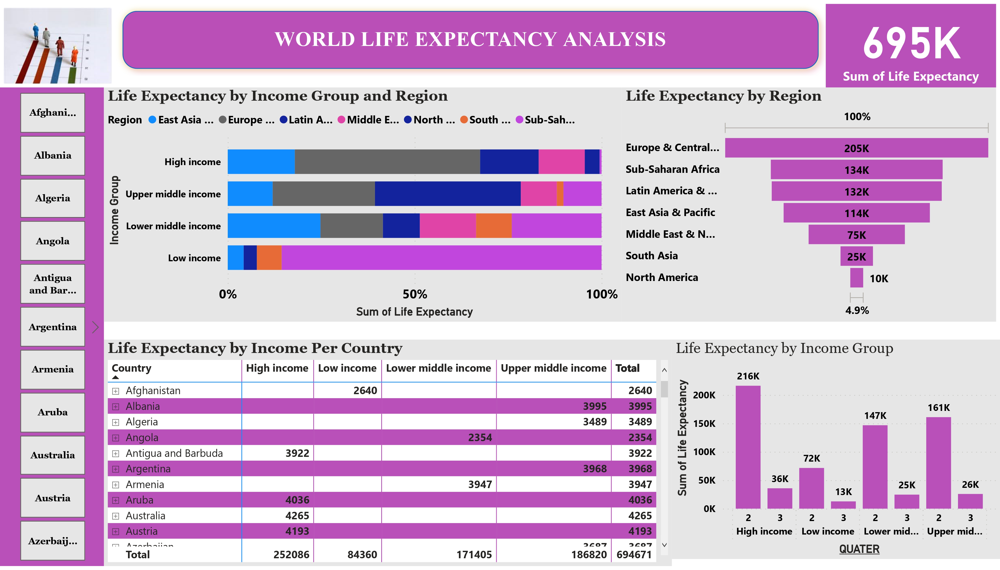
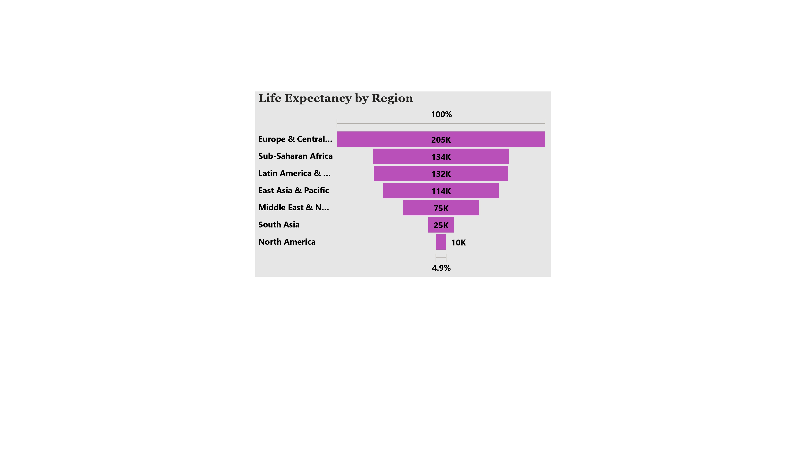
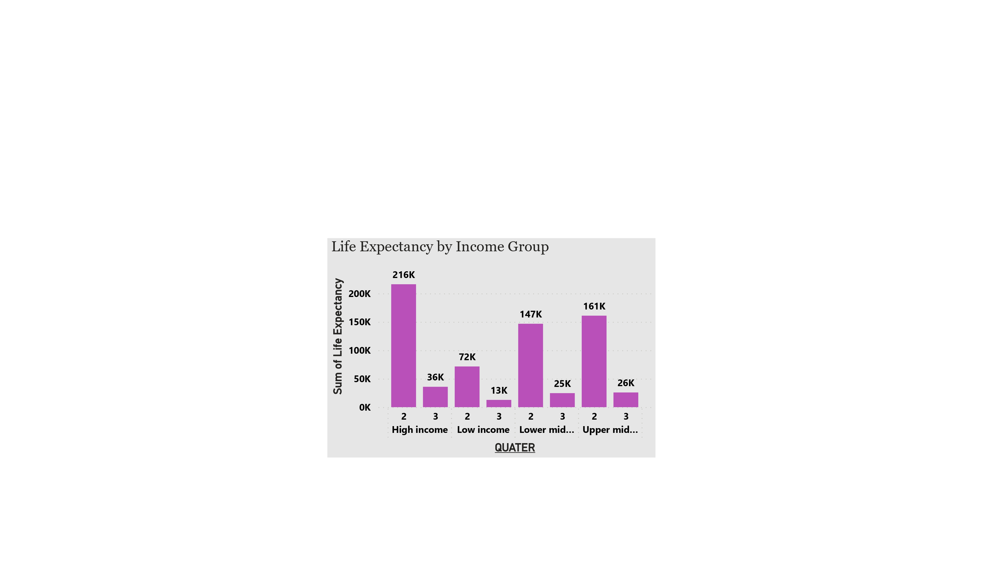
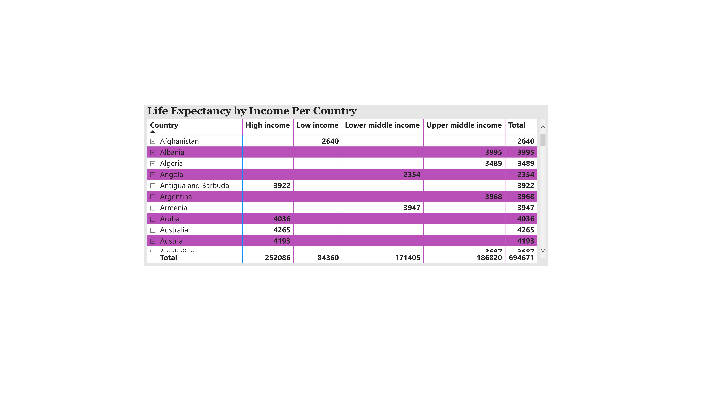

# life-expectancy-analysis-new

## Introduction
Life expectancy is the key metric for assessing population health. Broader than the narrow metric of the infant and child mortality, which focus solely at mortality at a young age, life expectancy captures the mortality along the entire life course. It tells us the average age of death in a population.
The project is to analyze and derive insights to answer crucial and vital questions with the sole aim of helping individual to gain insight into average age of death in a population in different countries of the World and also helped individualsmake data driven decisions on life exppectancy in determining how nations fair and in which countries to best resides.

**_ Disclaimer_**: _All data set are source from online data bank i.e "Kaggle", hence this data wasw collected soley by Kaggle.
## Problem Statements
- Which region has the highest life expectancy?
- Which Country has the best/highest life expectancy?
- Which income range has the predominant life expectancy?
- What is the effects of income on life expectancy?
- Which quarter of the year produce the best life expectancy?
- What other underline factors are responsible in different countries?
- ## **Skills and Concepts Demonstrated**
The following powerBi features were incorporated
- Power query
- Modelling
- Filter
- Page Navigation 
- Data analysis Expression(DAX)
- Tranformation
- Visualizations etc.

## Visualizations
The report comprises of 5 pages:
- Life Expectancy by income per Countries
- Life Expectancy By region
- Life Expectancy Income Group
- Life Expectancy by Income group and Region
- Countries Slicer
- Your can interract with the report using the link here
- (
https://app.powerbi.com/links/SL_P4MD8Zo?ctid=0c3b6bcc-15ab-408e-b9c1-11a02205649c&pbi_source=linkShare
)

Further interraction is aslo possible via the barcode 

##**Features**

## Analysis and Insights
**Life Expectancy by Region**:
This clearly showed Europe and central Asia as region with the highest Life Expectancy and North America with the Lowest. it is however suprising to see Sub-Shaara Africa Ranking Second Despite been ranked among the lowest income earner.

**Life Expectancy by Income**:
This also show a corresponding and positive relationship between Income and Life Expectancy i.e as Income Increase, Life Expectancy also does, the major variant is low income group in some countries having Life Expectancy. This is belief to be affected by other underline factors.

**Life Expectancy by Country**
Some selected countries were choosen for case studies here;
- Overall Sum of Life Expectancy is currently at 694671. Sum of Life Expectancy for Country Isle of Man and 18 other segments is significantly lower than others.
 - High for Europe & Central Asia : Overall Sum of Life Expectancy is currently at 216245. Sum of Life Expectancy for Region Europe & Central Asia is significantly higher than other segments, and Sum of Life Expectancy for Country Sint Maarten (Dutch part) and 13 other segments is significantly lower.
- Nigeria: At 37, Sum of Life Expectancy for Year 1960 is unusually low
- UK: At 82, Sum of Life Expectancy for Year 2015 is unusually high
- Ethopia: Overall Sum of Life Expectancy is currently at 2720. Sum of Life Expectancy for Year 2015 and other segments are significantly higher than others.

##**Recommendations**
Although Life Expectancy is expected to increase as Income Increases, this is because life expectancy is belief to improve as quality of life also improve. However, it is really worrisome to see Sub-Shaara Africa ranking second despite been the lowest as regards income, it is therefore imprative that some other underline factors such as genetics, environment, Crime rate, Gender etc but are not captured in this analysis. Further data driven analysis can help corroborate this assumption. 
